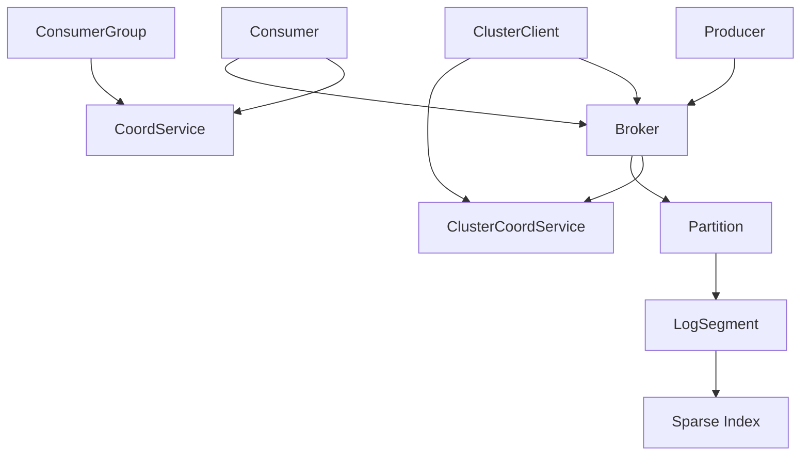
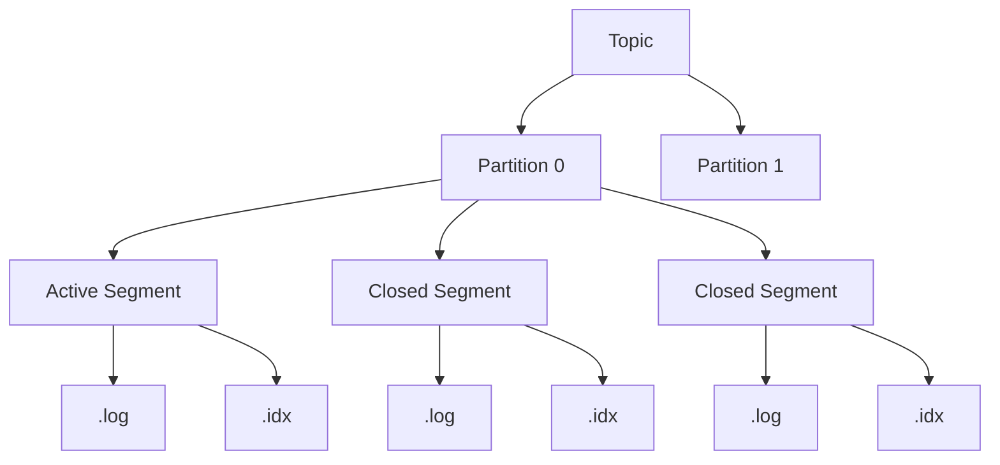
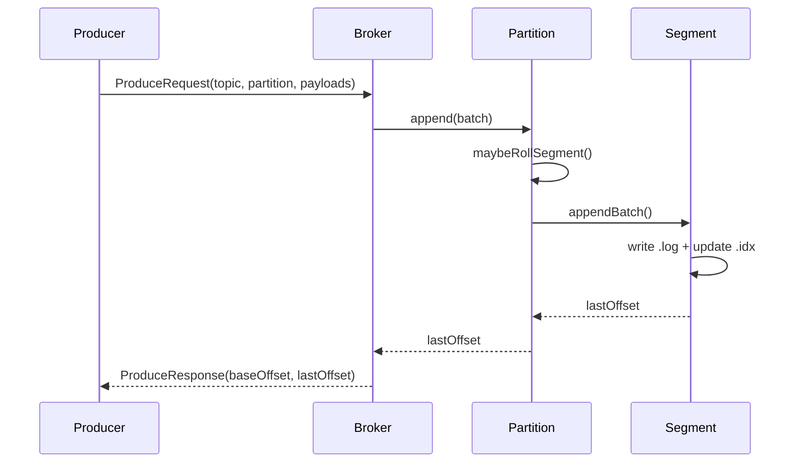
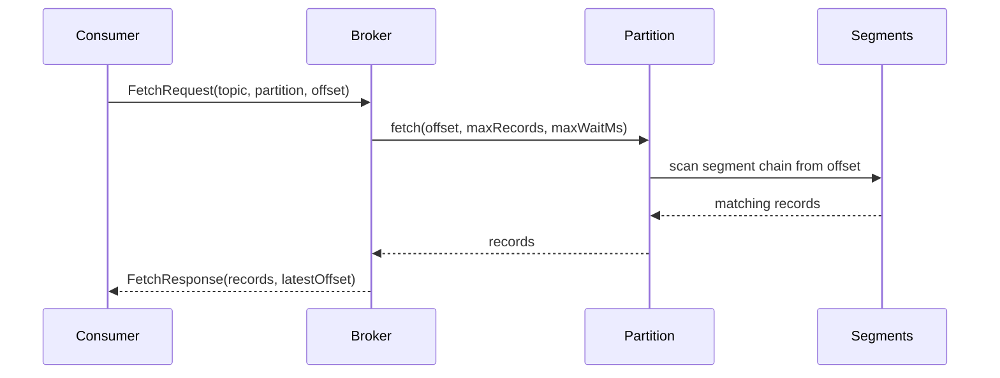
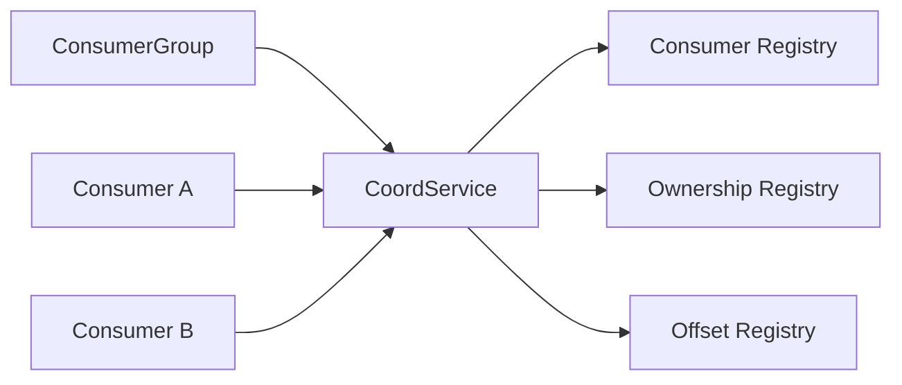
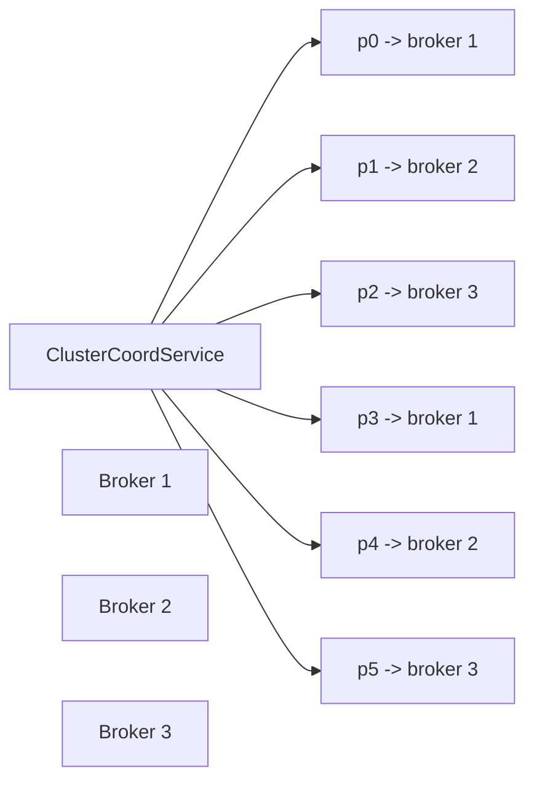

# Krafta

Krafta is a Java implementation of a Kafka-shaped distributed log system. It includes a local log engine, a single-broker API, partitioned topics with rolling segments and retention, coordinator-backed consumer groups, and a static multi-broker cluster model with owner-routed requests.

This repository intentionally stops before replication and leader election. In the current cluster model, each partition has exactly one owner broker.


## Repository Layout

```text
krafta/
├── README.md
├── app/
│   ├── build.gradle
│   └── src/
│       ├── main/java/com/krafta/
│       │   ├── App.java
│       │   ├── api/
│       │   │   ├── ProduceRequest.java
│       │   │   ├── ProduceResponse.java
│       │   │   ├── FetchRequest.java
│       │   │   ├── FetchResponse.java
│       │   │   ├── ListOffsetsRequest.java
│       │   │   └── ListOffsetsResponse.java
│       │   ├── bench/
│       │   │   └── BenchmarkRunner.java
│       │   ├── broker/
│       │   │   └── Broker.java
│       │   ├── client/
│       │   │   └── ClusterClient.java
│       │   ├── consumer/
│       │   │   ├── Consumer.java
│       │   │   └── ConsumerGroup.java
│       │   ├── coord/
│       │   │   ├── CoordService.java
│       │   │   └── ClusterCoordService.java
│       │   ├── exceptions/
│       │   │   ├── TopicAlreadyExistsException.java
│       │   │   └── TopicNotFoundException.java
│       │   ├── producer/
│       │   │   └── Producer.java
│       │   └── storage/
│       │       ├── Record.java
│       │       ├── RecordBatch.java
│       │       ├── LogSegment.java
│       │       └── Partition.java
│       └── test/java/com/krafta/
│           ├── BrokerIntegrationTest.java
│           ├── ProducerRoutingTest.java
│           ├── RecoveryTest.java
│           ├── StorageRollingRetentionTest.java
│           ├── ConsumerGroupCoordTest.java
│           └── ClusterRoutingTest.java
├── gradle/
├── gradlew
└── settings.gradle
```

## What This Repository Contains

### Storage layer

- [`Record`](app/src/main/java/com/krafta/storage/Record.java): one message with `offset`, `timestamp`, and `payload`.
- [`RecordBatch`](app/src/main/java/com/krafta/storage/RecordBatch.java): a batch of records plus CRC computation.
- [`LogSegment`](app/src/main/java/com/krafta/storage/LogSegment.java): segment file append/read, sparse index, CRC validation, and recovery from partial tails.
- [`Partition`](app/src/main/java/com/krafta/storage/Partition.java): multiple-segment partition manager with rolling by size/time, time-based retention, and cross-segment fetch.

### Broker and client API layer

- [`Broker`](app/src/main/java/com/krafta/broker/Broker.java): create topics, expose `produce`, `fetch`, and `listOffsets`, and enforce owner-only partition access in cluster mode.
- [`api/*`](app/src/main/java/com/krafta/api): request/response types used by broker-facing operations.
- [`Producer`](app/src/main/java/com/krafta/producer/Producer.java): explicit, round-robin, and key-based partition routing.
- [`ClusterClient`](app/src/main/java/com/krafta/client/ClusterClient.java): metadata-aware client router for the multi-broker owner model.

### Coordination layer

- [`CoordService`](app/src/main/java/com/krafta/coord/CoordService.java): consumer-group coordinator with consumer registry, ownership registry, offset registry, and deterministic range assignment.
- [`ClusterCoordService`](app/src/main/java/com/krafta/coord/ClusterCoordService.java): broker registry plus static `topic-partition -> ownerBrokerId` metadata.
- [`Consumer`](app/src/main/java/com/krafta/consumer/Consumer.java): fetches data and commits offsets through the coordinator when attached to a group.
- [`ConsumerGroup`](app/src/main/java/com/krafta/app/src/main/java/com/krafta/consumer/ConsumerGroup.java): group membership wrapper around `CoordService`.

### Runtime and validation

- [`App`](app/src/main/java/com/krafta/App.java): manual smoke runner.
- [`BenchmarkRunner`](app/src/main/java/com/krafta/bench/BenchmarkRunner.java): lightweight benchmark harness.
- [`app/src/test/java/com/krafta`](app/src/test/java/com/krafta): JUnit integration tests for broker, routing, recovery, storage, coordinator, and cluster behavior.

## Architecture



## Storage Model



The storage stack is layered like this:

1. A topic is split into partitions.
2. A partition owns one active segment and zero or more closed segments.
3. Each segment has:
   - a `.log` file for record batches
   - a `.idx` sparse index file for faster offset lookup
4. When the active segment crosses size or age thresholds, a new segment is opened.
5. When closed segments get old enough, retention removes them.

## Produce Path



What happens in code:

- `Producer` decides the target partition:
  - explicit partition
  - round-robin
  - key-based hash
- `Broker.produce(...)` converts payloads into `Record`s and wraps them into a `RecordBatch`.
- `Partition.append(...)` checks whether the active segment must roll.
- `LogSegment.appendBatch(...)` writes bytes into the segment log and updates the sparse index.
- Broker returns offsets to the caller.

## Fetch Path



What happens in code:

- `Broker.fetch(...)` resolves the target partition.
- `Partition.fetch(...)` reads across one or many segments.
- If data is not yet available and `maxWaitMs > 0`, the partition can long-poll and wake on append.
- The broker returns records plus the latest visible offset.

## Consumer Groups



### What the consumer-group pieces store

- Consumer registry:
  - which members are in the group
  - each member's last heartbeat
  - each member's session timeout

- Ownership registry:
  - which member currently owns each partition

- Offset registry:
  - committed offset per group and partition

### Deterministic range assignment

Members are sorted by member id. Partitions are sorted by partition number. The coordinator splits the partition list into stable contiguous ranges.

Example:

- partitions: `[0, 1, 2, 3]`
- members: `[member-a, member-b]`
- assignment:
  - `member-a -> [0, 1]`
  - `member-b -> [2, 3]`

This means the same membership set always gives the same assignment.

### Rebalancing

Rebalance happens when:

- a new member joins
- a member leaves
- a member times out because heartbeats stop

When that happens:

1. coordinator increments group generation
2. partitions are reassigned with deterministic range assignment
3. stale ownership is removed
4. consumers sync new assignments from coordinator

## Multi-Broker Cluster Model

Krafta does not use leaders and replicas. It uses an owner-only model.



In this model:

- each partition has one owner broker
- only that broker creates local storage for that partition
- `ClusterClient` reads metadata from `ClusterCoordService`
- produce/fetch/listOffsets requests are routed directly to the owner broker

## Benchmark Environment


- OS: Ubuntu 24.04.4 LTS
- Architecture: x86_64
- CPU vendor: AMD
- CPU model: AMD Ryzen 5 5600H with Radeon Graphics
- Physical cores: 6
- Threads: 12
- Max clock: 4280.98 MHz
- RAM: 15 GiB total
- Available RAM at capture time: 5.8 GiB
- Swap: 0
- Primary filesystem: `/dev/nvme0n1p6`
- Disk size: 128G
- Disk available at capture time: 14G

## Latest Benchmark Snapshot

Current benchmark runner scenarios:

- single-broker produce
- single-broker fetch
- multi-broker owner-routed produce

Latest median summary:

| Scenario | Brokers | Partitions | Messages | Payload Bytes | Median Elapsed ms | Median Msgs/sec | Median MB/sec | Median Avg latency us |
|---|---:|---:|---:|---:|---:|---:|---:|---:|
| Single Broker Produce | 1 | 1 | 50000 | 128 | 688.26 | 72647.00 | 8.87 | 13.77 |
| Single Broker Fetch | 1 | 1 | 50000 | 128 | 1111.04 | 45002.68 | 5.49 | 22.22 |
| Multi Broker Produce | 3 | 6 | 50000 | 128 | 609.02 | 82099.25 | 10.02 | 12.18 |


## Test Coverage

Current JUnit test files:

- [`BrokerIntegrationTest`](app/src/test/java/com/krafta/BrokerIntegrationTest.java)
- [`ProducerRoutingTest`](app/src/test/java/com/krafta/ProducerRoutingTest.java)
- [`RecoveryTest`](app/src/test/java/com/krafta/RecoveryTest.java)
- [`StorageRollingRetentionTest`](app/src/test/java/com/krafta/StorageRollingRetentionTest.java)
- [`ConsumerGroupCoordTest`](app/src/test/java/com/krafta/ConsumerGroupCoordTest.java)
- [`ClusterRoutingTest`](app/src/test/java/com/krafta/ClusterRoutingTest.java)

They cover:

- basic append/fetch
- producer routing
- restart recovery
- segment rolling
- retention
- consumer-group coordination
- static cluster routing

## Commands

Run the smoke flow:

```bash
./gradlew run
```

Run all tests:

```bash
./gradlew test
```

Run the benchmark report:

```bash
./gradlew benchmark
```
## LICENSE
 MIT License.